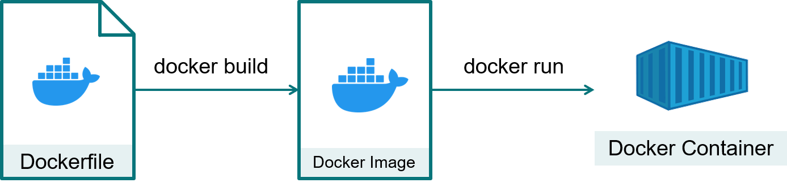

# Example 1

In this example we build a Docker image for running a Python script which prints "Hello world" to the screen.



*Building a Docker image and wiring up a container*

## Creating the Dockerfile
The `Dockerfile` contains all build instructions for the image. In our case we build our image based on the [official Python image](https://hub.docker.com/_/python) from Docker Hub.
This is achieved with the following instruction
```
FROM python:3
```
which will pull the official Python image (at the time of writing this tutorial, python:3 will include the python version 3.11). You can specify a specific image to pull from. For example you could use `FROM python:3.10` if you want Python 3.10.

Next we create a user in our Docker image. We do this to avoid any code will be executed later as the root user.
```
RUN useradd --create-home test_user
```
With the command `RUN`, we tell Docker to run a command inside our image. In this case we run the linux `useradd` command (note that the python Docker image comes as a Debian Linux distribution) to create a new user `test_user`. With the option `--create-home` we ask to not only to create this new user, but as well to create the home directory of this user.

Next we switch our user from the root user to this new user
```
USER test_user
```
and then change our working directory to the home directory of `test_user`
```
WORKDIR /home/test_user
```
At this point we are ready to add our Python script to the image. Files can be copied inside a Docker image with the `COPY` command. In our case we want to copy `hello.py` to our work directory:
```
COPY hello.py .
```
Note the paths. For the source path (first argument of the `COPY` command), the path is relative to the location of the `Dockerfile`. For the destination path, it is relative to the working directory in our Docker image. We could as well have used `COPY hello.py /home/test_user` instead if we want to use an absolute path.

Finally we can ask to execute our script inside the image with the `CMD` command
```
CMD [ "python3", "hello.py" ]
```
The difference between the `CMD` and the `RUN` command is that `CMD` can later be over-written when a container build based on our image is run. You can read more [here](https://stackoverflow.com/questions/37461868/difference-between-run-and-cmd-in-a-dockerfile).

## Building the Docker image
With our `Dockerfile` ready, we can build an image. In the same path as your `Dockerfile`, execute
```
docker build -t docker-tutorial/ex1 .
```
The [docker build](https://docs.docker.com/engine/reference/commandline/build/) command will build our image based on the `Dockerfile` in the path `.` (i.e. inside the path were we run that command). You could specify the full path to the `Dockerfile` if you wish, or if the `Dockerfile` is in a different location. With the `-t` (short for `--tag`) we tag our image. The usual convention is to use tags like this `author/image-name`.

When running the first time, the building of our image you will generate typically an output like this:
```
[+] Building 8.0s (9/9) FINISHED                                                                              
 => [internal] load build definition from Dockerfile                                                     0.6s
 => => transferring dockerfile: 176B                                                                     0.0s
 => [internal] load .dockerignore                                                                        0.8s
 => => transferring context: 2B                                                                          0.0s
 => [internal] load metadata for docker.io/library/python:3                                              0.9s
 => [internal] load build context                                                                        0.7s
 => => transferring context: 55B                                                                         0.0s
 => CACHED [1/4] FROM docker.io/library/python:3@sha256:30f9c5b85d6a9866dd6307d24f4688174f7237bc3293b92  0.0s
 => [2/4] RUN useradd --create-home test_user                                                            2.9s
 => [3/4] WORKDIR /home/test_user                                                                        1.2s
 => [4/4] COPY hello.py .                                                                                0.8s
 => exporting to image                                                                                   1.2s
 => => exporting layers                                                                                  1.1s
 => => writing image sha256:616d922ce80ce68828f6decd330a0fa8c7ff0b3dc40f3c1375de421e19ca9b1c             0.0s
 => => naming to docker.io/docker-tutorial/ex1                                                           0.1s
 ```
This output may differ depending on which images are already in the cache of Docker (for example if you already used `python:3` previously, Docker doesn't need to build it anymore).
 
You can check that your image is now built by inspecting the images present in Docker:
```
docker images
```
and you should see something like
```
REPOSITORY                                TAG       IMAGE ID       CREATED          SIZE
docker-tutorial/ex1                       latest    ced14180b43d   3 minutes ago    153MB
<none>                                    <none>    e6fa24f36b22   38 minutes ago   153MB
```
and maybe more, if you have other images already built.

The `<none>` image, is an image that was created during the building of our image, but we dont need it anymore. You can remove it safely like this
```
docker image rm e6fa24f36b22
```
Note that the `id` of the image will most likely differ in your case. Alternatively you can remove all unused images with the command
```
docker image prune
```
Docker will ask you if you really want to remove them:
```
WARNING! This will remove all dangling images.
Are you sure you want to continue? [y/N]
```

## Creating a container and running it
To create a container from our image and run it we use the [`docker run`](https://docs.docker.com/engine/reference/commandline/run/) command
```
docker run --name ex1 docker-tutorial/ex1
```
We used here the option `--name` which will assign a name to our container (otherwise Docker will chose one for us). Finally, the argument `docker-tutorial/ex1` tells which image to use to create our container.

After successful completion you should see
```
Hello world
```
on your screen. You can inspect existing containers on your system with the command
```
docker ps --all
```
which should display (and maybe more, if more containers exist on your system)
```
CONTAINER ID   IMAGE                 COMMAND              CREATED         STATUS                     PORTS     NAMES
a1d804815f0e   docker-tutorial/ex1   "python3 hello.py"   8 seconds ago   Exited (0) 6 seconds ago             ex1
```
We find indeed our container `ex1`. It's status is `Exited (0)` which tels that the container exited and the error code was `0` (i.e. no error).

You can now remove this container as we no longer need it with
```
docker rm ex1
```
You can confirm it was removed by checking again `docker ps --all`.

It is possible to ask Docker to automatically remove containers once they exit. This is achieved with the `--rm` option of 'docker run' which will automatically remove the container once it exits. For our case this would look like this
```
docker run --rm --name ex1 docker-tutorial/ex1
```
resulting in same output as before. If now you run `docker ps --all`, you will no longer find the container `ex1` as it was automatically removed by Docker.

## Running interactively a container
Sometimes, especially for debugging, it is desired to run interactively a container. This can be done like so:
```
docker run -it --rm docker-tutorial/ex1 bash
```
The two options `--interactive` (short `-i`) and `--tty` (short `-t`) executes the container interactively and attach a pseudo `TTY` (screen if you prefer) to the container. The last argument (after the image name) is the command to execute within the container and it will replace the last `CMD` command defined in the `Dockerfile`. In our case we execute `bash` which will launch the `bash` shell within our container. Executing above command will result in something similar like this:
```
test_user@35a58e7c8afd:~$ 
```
The machine name (`35a58e7c8afd` in our case, will differ). We are now inside our Docker container runtime. As shows the prompt we are user `test_user`, the user defined in our `Dockerfile` and as confirms the `pwd` command within the home directory of that user (as we defined in our `Dockerfile`):
```
test_user@35a58e7c8afd:~$ pwd
/home/test_user
```
The interactive mode is useful to look around within the container and very handy for debugging when developing the `Dockerfile`.

To quit the runtime, we use simply the `exit` command. Once our runtime closed, we can check with `docker ps --all` that our Docker container is no longer present (because we used the `--rm` option to launch it).

## Cleaning up
At the end of this exercise it is a good practice to clean up Docker. Check with `docker ps --all` that no undesired containers are present and remove them if needed with `docker rm`.

We can as well remove our Docker image we created. With
```
docker images
```
we can list images and clean up the ones we no longer need. For example the Docker image created during our tutorial is removed like so:
```
docker image rm docker-tutorial/ex1
```
With 
```
docker image prune
```
we remove any unused images.