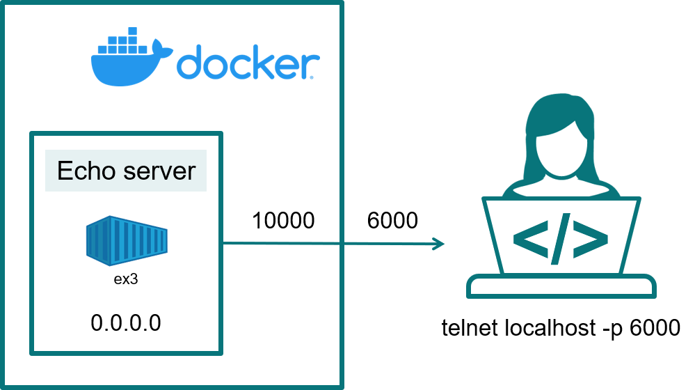

# Example 3
This example shows how to build a Docker image with a micro-service and how to run, stop and remove a container based on this image.


*Deployment diagram of this example*

The micro-service will run in a container named `ex3` and will require port mapping in order to be accessible from the Docker host. This aspect will be introduced during this example.

## Echo server
The Docker image we want to build will run a micro-service in form of a Python echo server. The [echo server](echo.py) listens to port `10000` on the `localhost` for incoming connections. 

Once a client connects to it, it will echo back to the client and data sent to the echo server.

You can try out the server by running:
```
python echo.py
```
In a different terminal on your machine running the echo server, open a `telnet` session connecting to the localhost on port `10000`:
```
telnet localhost 10000
```
which will result in
```
Trying 127.0.0.1...
Connected to localhost.
Escape character is '^]'.
```
You can now send data to the echo server, and the echo server will sent them back to you:
```
telnet localhost 10000
Trying 127.0.0.1...
Connected to localhost.
Escape character is '^]'.
This is a test
This is a test
```
To quit telnet press the `Ctrl` key together with the `]` key and type `quit` on the prompt:
```
telnet localhost 10000
Trying 127.0.0.1...
Connected to localhost.
Escape character is '^]'.
This is a test
This is a test
^]
telnet> quit
Connection closed.
```
To stop the echo server you will have to interrupt its execution with Ctrl-C.

Important note: Note that in `echo.py` the server is setup like this:
```
server_address = ('0.0.0.0', 10000)
```
which means the server binds to `0.0.0.0` which means it binds to all interfaces. This is key in order one can connect to the server from outside a Docker container.

## Creating and building the Dockerfile
The `Dockerfile` is essentialy the same as the one from [example 1](../ex1). The only difference is that we use `echo.py` as Python file we want to copy inside the Docker image. The image is built the usual way:
```
docker build -t docker-tutorial/ex3 .
```

## Running the service in detached mode
As our echo server will run indefinitely, we want to run the service in the so called detached mode where the Docker container will be run in the background. This is achieved like so:
```
docker run --rm --name ex3 -d docker-tutorial/ex3 
```
where we used the `--detach` (short `-d`) option. Executing `docker ps` confirms our container is up and running:
```
CONTAINER ID   IMAGE                 COMMAND             CREATED         STATUS         PORTS     NAMES
312e055c2e2e   docker-tutorial/ex3   "python3 echo.py"   5 seconds ago   Up 4 seconds             ex3
```
If you wish to stop the container you can use the [`docker stop`](https://docs.docker.com/engine/reference/commandline/stop/) command:
```
docker stop ex3
```
As we did run the container with the `--rm` option, it got automatically removed as confirms `docker ps --all`.

## Port mapping
You may ask how to connect to the echo server inside the container. Of course, running on our Docker host `telnet localhost 10000` will fail as no server is running on port `10000`. In order to access the echo server inside the container, we need to forward port `10000` to a port on our machine. This can be achieved with the `--publish` (short `-p`) option when running the container like so:
```
docker run --rm --name ex3 -d -p 6000:10000 docker-tutorial/ex3
```
This will forward port `6000` from the Docker host to port `10000` in the container. In Docker this is called port mapping. More documentation can be found [here](https://docs.docker.com/config/containers/container-networking/).

The `docker ps` command shows the mapped port:
```
CONTAINER ID   IMAGE                 COMMAND             CREATED         STATUS         PORTS                                         NAMES
f128f784fabd   docker-tutorial/ex3   "python3 echo.py"   8 seconds ago   Up 6 seconds   0.0.0.0:6000->10000/tcp, :::6000->10000/tcp   ex3
```
It is now possible to connect to the echo server inside the container like so:
```
telnet localhost 6000
```
Because of the option `-p 6000:10000` used in `docker run`, the traffic of port `6000` is forward to port `10000` inside the container, where the echo server is listening.

Once the container is no longer needed, stop it with `docker stop ex3`, which will automatically remove it because of the `--rm` option which was used during the `docker run` command.


## Cleaning up
At the end of this exercise it is a good practice to clean up Docker. Check with `docker ps --all` that no undesired containers are present and remove them if needed with `docker rm`.

We can as well remove our Docker image we created. With
```
docker images
```
we can list our images and clean up the ones we no longer need. For example the Docker image created during this exercice:
```
docker image rm Docker-tutorial/ex3
```
With 
```
docker image prune
```
you can as well remove any unused images.
