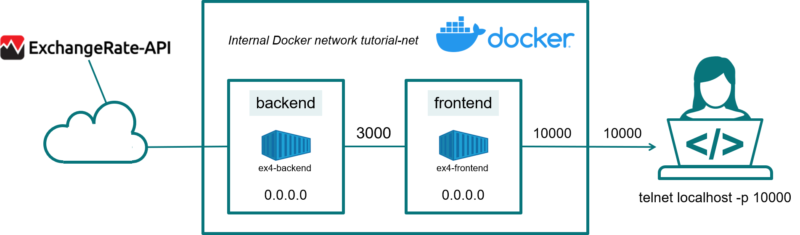

# Example 4
In this example we will run two micro-services in two Docker containers. We will see how, using Docker networks, it is possible to make the two containers talk to each others.

The two micro-services are a front-end and a back-end. They simulate a more complex situation one can encounter in a real situation.



*Two micro-services connected by an internal Docker network*

The front-end, listening on port `10000`, proposes to the connecting client to chose among three products. When the client chooses one of the products, the front-end will contact the back-end micro-service to ask to convert the prize from CAD to USD. Once converted, the front-end will inform the client about the prize of the product in USD.

## Back-end micro-service
The [back-end micro-service](backend.py) is a TCP server listening on port `3000`. It expects to recive a number (the prize in CAD). Whenever a connection happens, the micro-service gets the current exchange rate of CAD to USD. After, it converts the prize in USD and sends it back to the connecting client.

The Docker configuration is stored in `Dockerfile.backend` and presents nothing new compared to our previous examples. To build the image we proceed like so:
```
docker build -t docker-tutorial/ex4-backend -f Dockerfile.backend .
```
where we have used the option `--file` (short `-f`) to indicate the file containing the docker configuration.

To test our docker image, we can start a container in detached mode like so:
```
docker run --rm --name backend -d -p 3000:3000 --hostname backend docker-tutorial/ex4-backend
```
Note that we map the ports in order we can access the service from our host. We have further added the option `--hostname` in order to give a name to our container host. We use here `backend`, the name we use in [`frontend.py`](frontend.py) to bind the port to the host running the service. This is required, such that later the front-end can find the back-end service.

To connect to the micro-service and ask to convert some prizes into USD we use telnet:
```
telnet localhost 3000
```
Any number sent to the service will be converted to USD and sent back to us.

## Front-end micro-service
The [front-end micro-service](frontend.py) is a TCP server listening on port `10000`. When it recieves a connection, it will ask the client to choose one among three products. Based on the client's choice, it will contact the back-end micro-service to convert the prize from CAD to USD and afterwards inform the client about the prize of the prodcut in USD.

The docker configuration is stored in `Dockerfile.frontend` and presents nothing new compared to our previous examples. To build the image we proceed like so:
```
docker build -t docker-tutorial/ex4-frontend -f Dockerfile.frontend .
```
where we have used the option `--file` (short `-f`) to indicate the file containing the docker configuration.

Let us create and run a container from this image:
```
docker run --rm --name frontend -d -p 10000:10000 docker-tutorial/ex4-frontend
```
However, contacting the front-end service does not result in the expected behaviour:
```
telnet localhost 10000
Trying 127.0.0.1...
Connected to localhost.
Escape character is '^]'.
Which product you wish to buy ?
1. A laptop
2. A PC
3. A server
1
Connection closed by foreign host.
```
The service does indeed answer to our request and asks us to choose one of the three products. But when choosing one of them, for example number `1` in our case, results in closing of the connection. A `docker ps --all` shows that the backend service is running
```
docker ps -all
CONTAINER ID   IMAGE                         COMMAND                CREATED          STATUS          PORTS                                       NAMES
fc84a0794240   docker-tutorial/ex4-backend   "python3 backend.py"   24 seconds ago   Up 22 seconds   0.0.0.0:3000->3000/tcp, :::3000->3000/tcp   backend
```
and is mapping the port 3000. But still the front-end could not contact the back-end service. The reason is that the front-end and back-end containers are isolated from each others. Only the Docker host can communicate, because of the port mapping, with the back-end and front-end services. To solve this problem we need to attach both containers to a common network which is the topic of the next section.

## Docker networks
Docker networks are created with the ['docker network create'](https://docs.docker.com/engine/reference/commandline/network_create/) command. Let us create a network for our example:
```
docker network create tutorial-net
```
We can verify its creation by inspecting the list of all networks:
```
docker network ls
```
Among others, you will see our network:
```
NETWORK ID     NAME              DRIVER    SCOPE
06984140ae9a   tutorial-net      bridge    local
```
The default type of network is a so-called 'bridge' network. This is the type of network we need for our purpose. It is an isolated network for a single Docker engine (which is our use-case, as we run a single Docker engine on our machine). In the examples using Docker Swarm we will discuss the usage of the second type of networks, the `overlay` networks, which spans multiple Docker hosts.

We can now use our network to enable the communication between the back-end and front-end containers. Let us start by stopping any running container. Check which containers are active with `docker ps` and stop any running one. Normally, you should have a bakend container running and need to stop it:
```
docker stop backend
```
which will as well remove its container as we used the `--rm` option in `docker run`.

Let us now create and run again our containers, but this time we attach our `tutorial-net` network to them using the `--net` option. For the back-end container we proceed like this:
```
docker run --rm --name backend -d --expose 3000 --hostname backend --net tutorial-net docker-tutorial/ex4-backend
```
Note the `--expose` option. This options allows to expose ports. This makes the port visible to any other container connected to the same network. The port is however not forwarded to the host and consequently we can no longer access directly the back-end micro-service from our host. This is intended. We want only the front-end micro-service be accessible from outside. We can check this like so:
```
telnet localhost 3000
Trying 127.0.0.1...
telnet: Unable to connect to remote host: Connection refused
```
The back-end service can indeed not be reached.

Let us now create and run our front-end micro-service:
```
docker run --rm --name frontend -d -p 10000:10000 --net tutorial-net docker-tutorial/ex4-frontend
```
We attach it to our `tutorial-net` network and as we want to be able to reach it from our host, we map the container port `10000` to the port `10000` of our host (we could have chosen here any free port on the host we wish).

This time, our two services can talk to each others and everything behaves as intended:
```
telnet localhost 10000
Trying 127.0.0.1...
Connected to localhost.
Escape character is '^]'.
Which product you wish to buy ?
1. A laptop
2. A PC
3. A server
1
Today your item costs 1478.07 USD
```
We choose a product (the laptop in our case) and the front-end service contacts the back-end micro-service to convert its prize into USD, which is then returned to the front-end and from the front-end to us (note that you will most likely see a different prize, as the exchange rate will be different than from the one at time of writing this tutorial).

## Cleaning up
At the end of this exercise it is a good practice to clean up the Docker engine. Check with `docker ps --all` that no undesired containers are present and stop them if needed with `docker stop`. This will most likely be
```
docker stop frontend backend
```
We should as well remove our `tutorial-net` network with
```
docker network rm tutorial-net
```

We further remove the Docker image we created during this tutorial with
```
docker image rm docker-tutorial/ex4
```
With 
```
docker image prune
```
we can remove any unused images.
